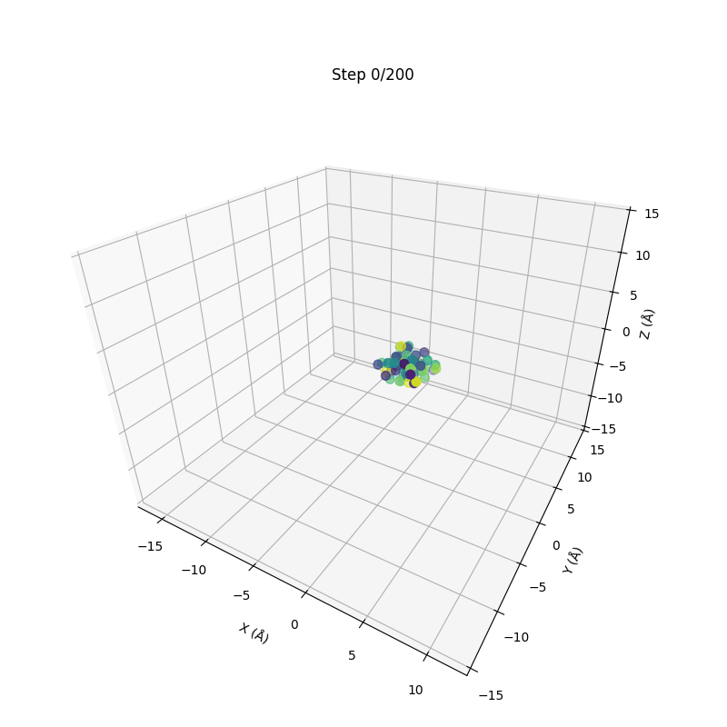
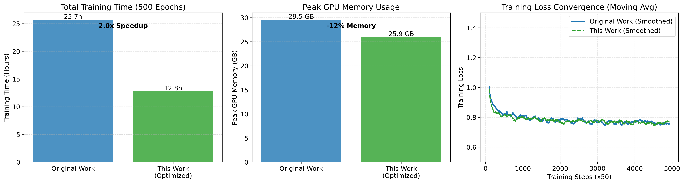
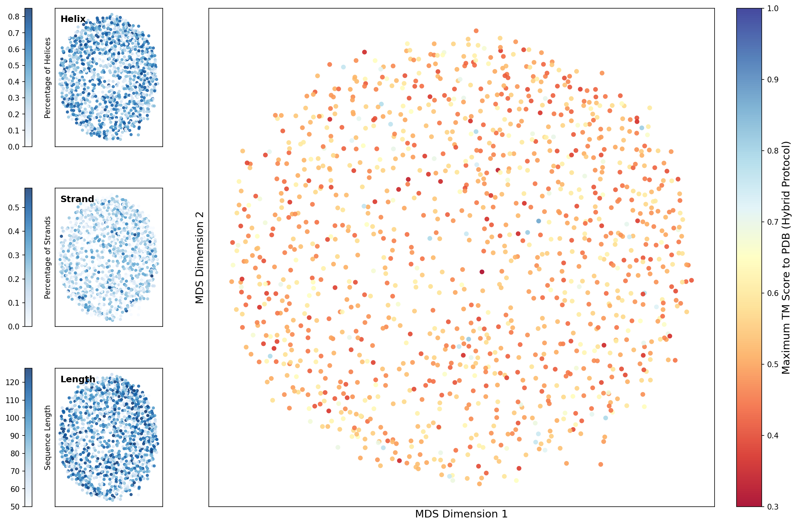
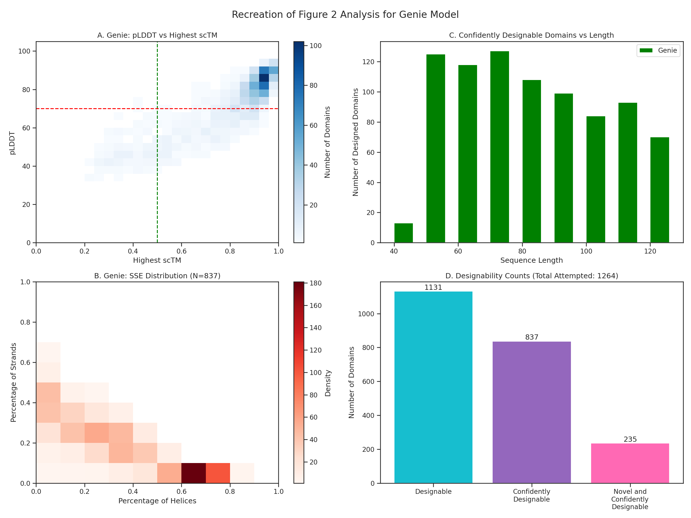
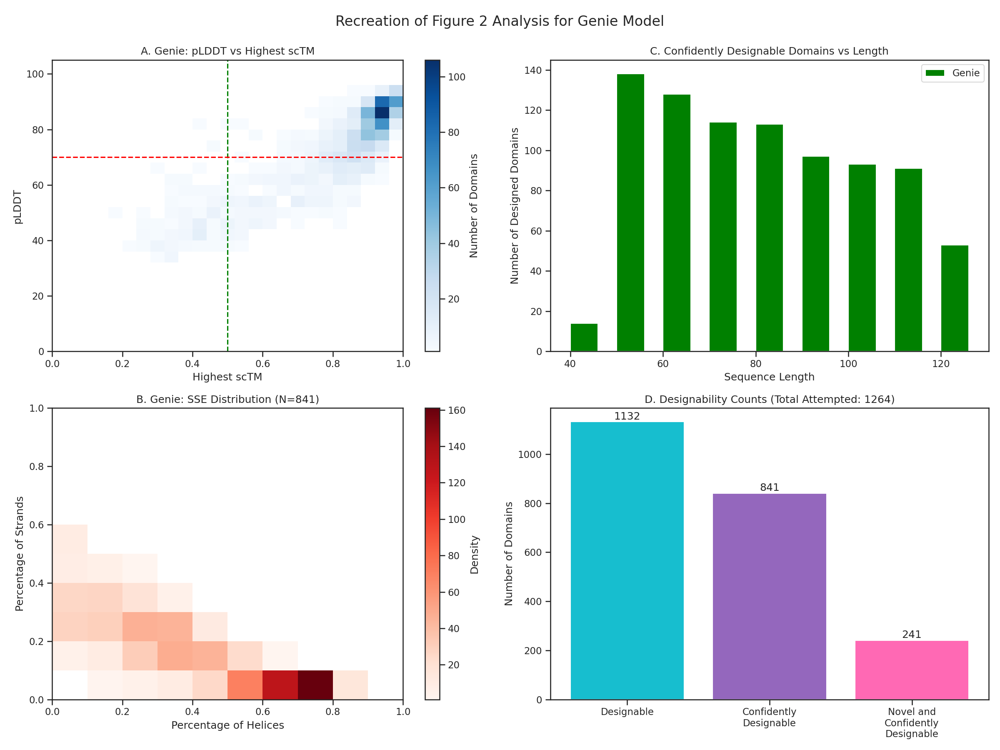
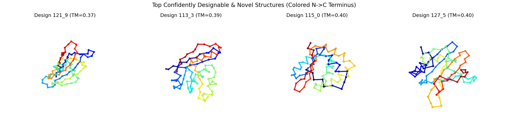

# Genie: De Novo Protein Design

Genie is a diffusion-based model for de novo protein design through equivariantly diffusing oriented residue clouds.

This project is a reproduction and optimization of [https://github.com/aqlaboratory/genie](https://github.com/aqlaboratory/genie).

**Read this in other languages:  [中文](README_zh.md)**

**View the demo notebook:** [genie_demo.ipynb](genie_demo.ipynb)
## Installation

1.  **Clone the repository:**
    ```bash
    git clone https://github.com/northws/genie.git
    cd genie
    ```

2.  **Install dependencies:**
    It is recommended to use a virtual environment (e.g., Conda or venv).
    ```bash
    pip install -e .
    ```

3.  **Setup Data (Optional):**
    For training, you need to download and preprocess the SCOPe dataset.
    ```bash
    bash scripts/install_dataset.sh
    ```

4.  **External Tools:**
    The repository includes `TMscore` and `TMalign` binaries in `packages/TMscore/`. Ensure they are executable:
    ```bash
    chmod +x packages/TMscore/TMscore packages/TMscore/TMalign
    ```
    If you encounter issues, you may need to recompile them using the provided C++ source files in the same directory:
    ```bash
    g++ -static -O3 -ffast-math -lm -o packages/TMscore/TMscore packages/TMscore/TMscore.cpp
    g++ -static -O3 -ffast-math -lm -o packages/TMscore/TMalign packages/TMscore/TMalign.cpp
    ```

## Usage

### 1. Training

To train a new model from scratch.

```bash
python genie/train.py \
    --config example_configuration \
    --gpus 0,1
```

**Arguments (genie/train.py):**

- `-c, --config` (required): Path/name of the configuration file to use. This is passed into the training code to define model/training hyperparameters.
- `-g, --gpus`: GPU devices to use (e.g., `"0"` or `"0,1"`). This typically controls `CUDA_VISIBLE_DEVICES` / multi-GPU selection.
- `-r, --resume`: Path to a checkpoint (`.ckpt`) file to resume training from.

Configuration files define model hyperparameters and training settings. See `genie/config.py` for details.

### 2. Sampling

To generate protein backbones using a pre-trained model.

**Note on Pre-trained Weights:**
The provided `weights/` directory contains checkpoint files. The sampling script expects a specific directory structure (e.g., `runs/<model_name>/version_<X>/checkpoints/`). You may need to restructure the weights or use the provided Jupyter Notebook which handles this automatically.

Standard command:
```bash
python genie/sample.py \
    --rootdir runs \
    --model_name scope_l_128 \
    --model_version 0 \
    --model_epoch 49999 \
    --batch_size 5 \
    --num_batches 1 \
    --gpu 0
```

**Arguments (genie/sample.py):**

- `-n, --model_name` (required): Name of the Genie model (directory name under `runs/`).
- `-r, --rootdir` (default: `runs`): Root directory containing the `runs/<model_name>/...` structure.
- `-v, --model_version`: Model version number (expects `runs/<model_name>/version_<N>/...`).
- `-e, --model_epoch`: Epoch number of the checkpoint to load (used to select a checkpointed model).
- `-g, --gpu`: GPU device to use. Note: this flag accepts an optional value; `--gpu` alone implies GPU `0`, while `--gpu 1` selects GPU `1`.
- `--batch_size` (default: `5`): Number of samples generated per batch.
- `--num_batches` (default: `2`): Number of batches to generate. Total samples = `batch_size * num_batches`.
- `--noise_scale` (default: `0.6`): Sampling noise scale controlling stochasticity/diversity.
- `--min_length` (default: `50`): Minimum sequence length to sample.
- `--max_length` (default: `128`): Maximum sequence length to sample.
- `--save_trajectory`: If set, saves intermediate diffusion timesteps (trajectory `.npy`) for visualization. Adds disk usage and runtime.

### 3. Visualization

You can visualize the generated structures (Saved as `.npy` coordinate files) using the provided scripts.

**Structure coordinate visualization (evaluations/visualize.py):**

```bash
python evaluations/visualize.py <input_file> -o <output_dir>
```

**Arguments (evaluations/visualize.py):**

- `input_file` (positional): Path to an input coordinate file (usually `.npy`; the loader also tries CSV/text).
- `-o, --output_dir` (optional): Directory to save outputs. If omitted, saves next to `input_file`.

**Alternative (similar interface):**

- `python evaluations/visualize_protein.py <input_file> -o <output_dir>`: Produces a smoother “protein-like” backbone visualization.

**Trajectory visualization (evaluations/visualize_trajectory.py):**

```bash
python evaluations/visualize_trajectory.py <traj_npy> <output_gif>
```

**Arguments (evaluations/visualize_trajectory.py):**

- `traj_npy` (positional): Path to a trajectory `.npy` produced by `genie/sample.py --save_trajectory`.
- `output_gif` (positional): Path to the output `.gif` animation.

### 4. Analysis and Evaluation

This repository includes scripts for evaluating the novelty of generated designs and visualizing the design space.

#### Quality Evaluation (scTM & pLDDT)

To assess the designability of the generated backbones, use the evaluation pipeline. This step runs ProteinMPNN (inverse folding) and ESMFold (folding) to calculate self-consistency TM-scores (scTM) and pLDDT.

```bash
python evaluations/pipeline/evaluate.py \
    --input_dir runs/scope_l_128/version_0/samples/epoch_49999 \
    --output_dir runs/scope_l_128/version_0/samples/epoch_49999/evaluations
```
This generates an `info.csv` file required for the plotting scripts.

**Arguments (evaluations/pipeline/evaluate.py):**

- `--input_dir` (required): Directory containing input samples to evaluate.
- `--output_dir` (required): Directory to write evaluation results (including `info.csv`).
- `-g, --gpus` (optional): GPU devices to use (e.g., `"0"` or `"0,1"`).
- `-c, --config` (optional): Accepted for compatibility but ignored by the script.

#### Novelty Evaluation

To calculate the novelty of generated designs (TM-score against a reference database like PDB):

*   **CPU Version (Exact, Brute-force):**
    ```bash
    python evaluations/Novelty_Evaluation_CPU.py \
        --input_dir runs/scope_l_128/version_0/samples/epoch_49999/evaluations \
        --ref_dir data/pdbstyle-2.08 \
        --num_workers 4
    ```

    **Arguments (evaluations/Novelty_Evaluation_CPU.py):**

    - `-i, --input_dir`: Input directory. You can point to an evaluation directory containing `info.csv` and optionally a `designs/` subfolder.
    - `-o, --output_csv`: Output CSV path. Default: `<input_dir>/novelty.csv`.
    - `--ref_dir`: Reference database directory (e.g., `data/pdbstyle-2.08`).
    - `--tmalign`: Path to the `TMalign` executable.
    - `--num_workers`: Number of worker processes for parallel TM-align computations.
    - `--length_tolerance`: Pre-filter tolerance by length (default `0.3` means ±30%).
    - `--early_stop_tm`: Early-stop threshold (default `0.5`): stop searching once TM exceeds this value (treat as “not novel”).
    - `--no_early_stop`: Disable early stopping and search for the exact maximum TM.
    - `--no_length_filter`: Disable length-based pre-filtering.

*   **GPU Version (Hybrid, Faster):**
    ```bash
    python evaluations/Novelty_Evaluation_GPU.py \
        --input_dir runs/scope_l_128/version_0/samples/epoch_49999/evaluations \
        --ref_dir data/pdbstyle-2.08
    ```

    **Arguments (evaluations/Novelty_Evaluation_GPU.py):**

    - `-i, --input_dir`: Input directory containing PDB designs. If the directory contains a `designs/` subfolder, it will be auto-detected.
    - `-o, --output_csv`: Output CSV path. Default: `novelty_hybrid.csv` written into the evaluation directory (or the parent of `designs/`).
    - `-r, --ref_dir`: Reference database directory.


#### Plotting Analysis

Use the unified `evaluations/plot.py` script to generate analysis plots. This script combines functionality for MDS plots, general analysis (Figure 2 reproduction), and 3D structure visualization.

**Arguments:**

*   `-i, --input_dir`: **(Required)** Input directory containing evaluation data (must contain `info.csv`, optionally `novelty_hybrid.csv`, `pair_info.csv`).
*   `-p, --plot`: Which plot to generate.
    *   `analysis`: General Analysis (Figure 2 Reproduction). Plots pLDDT vs scTM, SSE distribution, and designability counts.
    *   `mds`: Design Space MDS Plot. Visualizes the distribution of generated samples using Multidimensional Scaling.
    *   `structures`: Novel Structure Examples. Visualizes the 3D structures of top novel designs.
    *   `all`: Generate all of the above (Default).
*   `-o, --output_dir`: Output directory for saving the plots. Default is the current directory.

**Examples:**

```bash
# Generate all plots
python evaluations/plot.py --input_dir runs/.../evaluations --output_dir outputs/plots

# Generate only the MDS plot
python evaluations/plot.py -i runs/.../evaluations -p mds -o outputs/plots
```

**Python API (evaluations/plot.py):**

- `get_default_run_dir()`:
    - Returns: default evaluation directory path used when `--input_dir` is not provided.
- `load_data(input_dir)`:
    - `input_dir`: evaluation directory containing `info.csv`.
    - Returns: `(df, has_novelty)` where `df` is the merged DataFrame and `has_novelty` indicates whether novelty CSV was found and merged.
- `parse_pdb_ca(filepath)`:
    - `filepath`: path to a `.pdb` file.
    - Returns: `N x 3` NumPy array of Cα coordinates.
- `plot_genie_analysis(input_dir, output_file='...png')`:
    - `input_dir`: evaluation directory containing `info.csv` (and optionally novelty csv).
    - `output_file`: output image path for the Figure-2-style analysis plot.
- `plot_genie_mds_novelty(input_dir, output_file='...png')`:
    - `input_dir`: evaluation directory containing `info.csv` and `pair_info.csv` (and optionally novelty csv).
    - `output_file`: output image path for the MDS design-space plot.
- `plot_structures(input_dir, output_file='...png')`:
    - `input_dir`: evaluation directory (or the `designs/` directory). Needs `info.csv`, novelty csv, and PDBs.
    - `output_file`: output image path for the 3D structure examples.
- `main()`:
    - CLI entrypoint; parameters are exposed via `-i/--input_dir`, `-p/--plot`, `-o/--output_dir`.

## Project Structure

-   `genie/`: Main package source code.
    -   `diffusion/`: Diffusion model implementation.
    -   `model/`: Neural network architecture.
    -   `data/`: Data loading and processing.
-   `evaluations/`: Evaluation pipeline components.
-   `packages/`: External tools (TMscore).
-   `scripts/`: Utility scripts for setup.
-   `weights/`: Pre-trained model weights.

## Citations and Acknowledgements

This project is built upon several excellent open-source projects and academic research results：
### Core Algorithm & Models
*   **Genie (Original Implementation)**:
    Lin, Y. C., & AlQuraishi, M. (2023). Generating protein backbone structures with equivariant diffusion models. *arXiv preprint arXiv:2301.12485*.
    [[Paper]](https://arxiv.org/abs/2301.12485) [[Code]](https://github.com/aqlaboratory/genie)

*   **Flash-IPA (Optimization)**:
    Flagship Pioneering. (2023). Flash-IPA: Accelerated Invariant Point Attention. GitHub.
    [[Code]](https://github.com/flagshippioneering/flash_ipa)

### Evaluation Pipeline
*   **ProteinMPNN (Sequence Design)**:
    Dauparas, J., et al. (2022). Robust deep learning–based protein sequence design using ProteinMPNN. *Science*, 378(6615), 49-56.
    [[Paper]](https://www.science.org/doi/10.1126/science.add2187) [[Code]](https://github.com/dauparas/ProteinMPNN)

*   **ESMFold / ESM-2 (Structure Prediction)**:
    Lin, Z., et al. (2023). Evolutionary-scale prediction of atomic-level protein structure with a language model. *Science*, 379(6637), 1123-1130.
    [[Paper]](https://www.science.org/doi/10.1126/science.ade2574) [[Code]](https://github.com/facebookresearch/esm)

*   **TM-score & TM-align (Structure Alignment)**:
    Zhang, Y., & Skolnick, J. (2005). TM-align: a protein structure alignment algorithm based on the TM-score. *Nucleic Acids Research*, 33(7), 2302-2309.
    [[Paper]](https://academic.oup.com/nar/article/33/7/2302/2401364) [[Code]](https://zhanggroup.org/TM-align/)

## Gallery

### Generation Process



## Optimization Results



We compared the training process parameters between the original implementation and our optimized version (files located in `Training_process_parameters/`).

**Hardware Configuration:**
*   **GPU:** RTX 5090 (32GB) * 1
*   **CPU:** 25 vCPU Intel(R) Xeon(R) Platinum 8470Q
*   **Memory:** 90GB

**Comparison Summary:**

| Metric | Original Work | This Work (Optimized) | Improvement |
| :--- | :--- | :--- | :--- |
| **Training Time (500 Epochs)** | ~25.7 Hours | ~12.8 Hours | **~2.0x Speedup** |
| **Max GPU Memory Usage** | ~29.53 GB | ~25.92 GB | **~12% Reduction** |
| **Training Loss (Final Epoch)** | ~0.758 | ~0.771 | Comparable |

The optimization reduced training time by half and GPU memory usage by approximately 12%. Analysis of step-wise loss (smoothed) confirms that the slight difference in final epoch loss is due to stochastic fluctuations, and both models exhibit identical convergence behavior.

### Generative Quality Comparison

We compared the generative quality of the original implementation and our optimized version. The results show that the optimized model maintains comparable generative capabilities.

**Design Space Analysis (MDS):**

| Original Work | This Work (Optimized) |
| :---: | :---: |
|  |  |

**Comprehensive Analysis:**

| Original Work | This Work (Optimized) |
| :---: | :---: |
|  |  |

**Novel Structure Examples (Optimized Work):**




