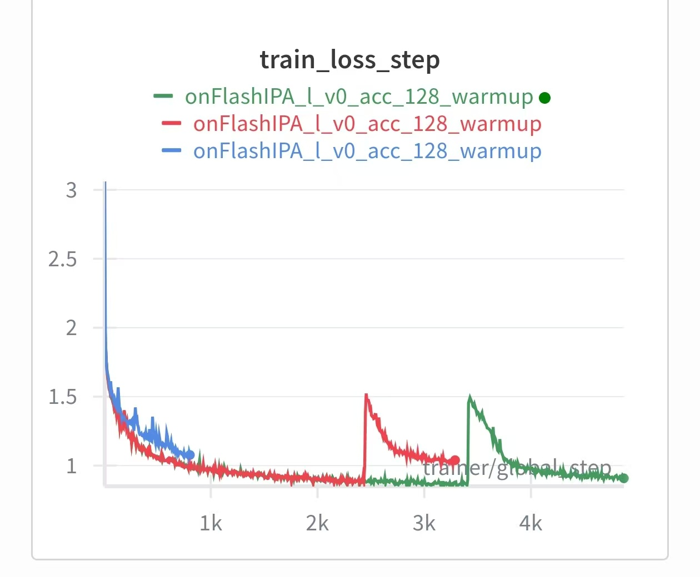
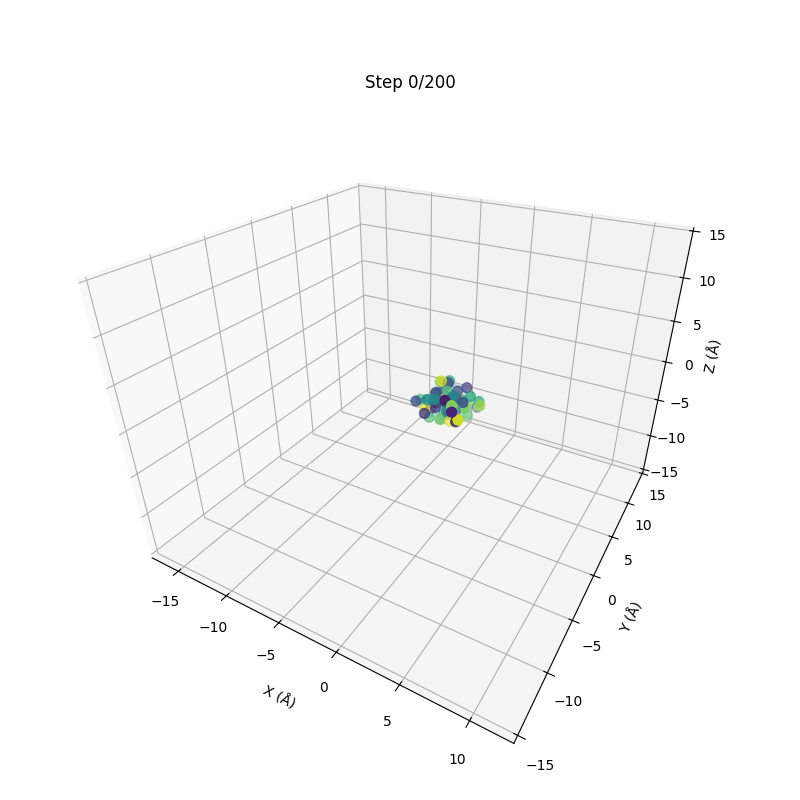
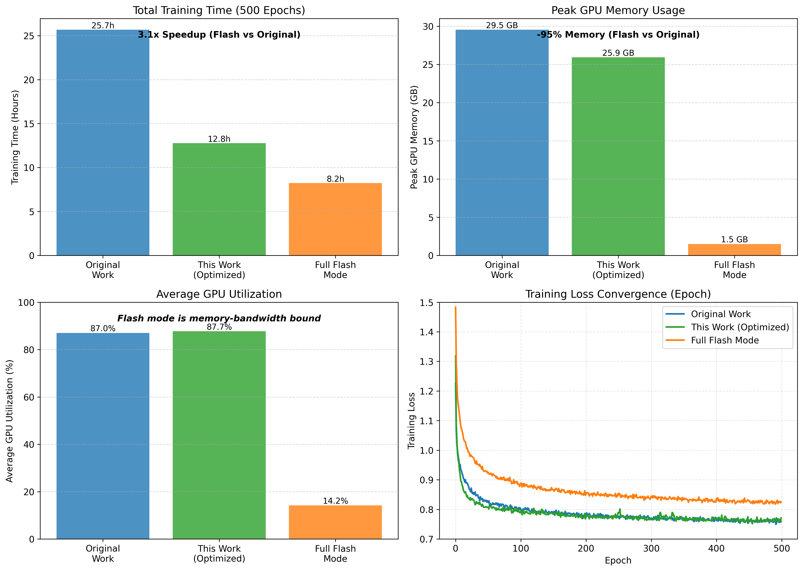
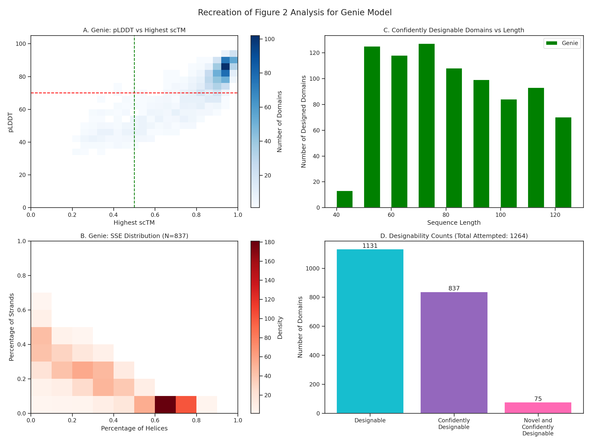
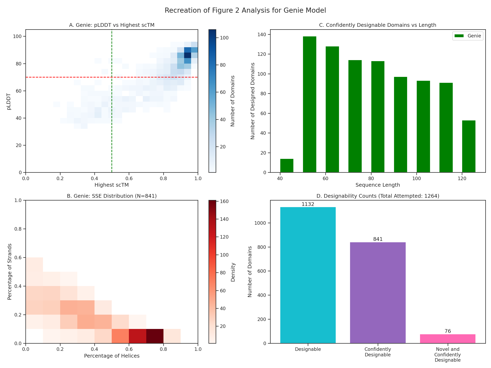
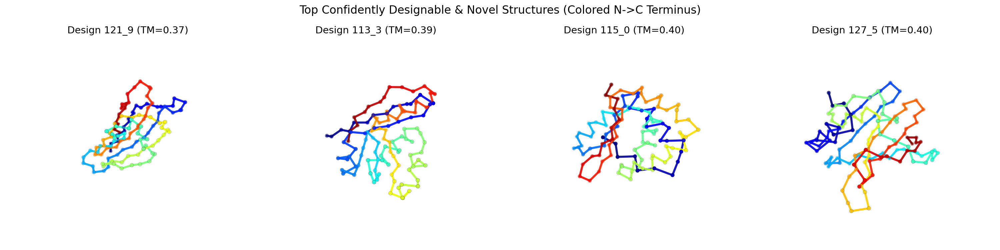

# Genie: 蛋白质从头设计 (De Novo Protein Design)

Genie 是一个基于扩散模型的蛋白质从头设计工具，通过对定向残基云进行等变扩散来实现。

## 关于本项目

本项目是对 Yeqing Lin 和 Mohammed AlQuraishi 原始 [Genie 实现](https://github.com/aqlaboratory/genie)的**优化复现**。

**主要改进：**
- ✨ 集成 Flash-IPA，实现内存高效的长序列生成
- 🔗 **支持 mHC + Flash-IPA 组合**，兼顾训练稳定性与内存效率
- ⚡ Flash Attention 优化，训练速度提升 3.1 倍
- 💾 Flash 模式下 GPU 显存降低 95%
- 🚀 大 batch 训练优化（学习率缩放、预热、梯度累积）
- 🔧 支持 PyTorch 2.9+ 和现代工具链

**原始工作：**
- 论文：[Generating Novel Protein Backbones with Equivariant Diffusion](https://arxiv.org/abs/2301.12485) (Lin & AlQuraishi, 2023)
- 原始仓库：https://github.com/aqlaboratory/genie
- 许可证：Apache 2.0

**本仓库：**
- 原始 Genie 代码：Apache License 2.0
- 新增优化和功能：MIT License
- 详见 [LICENSE.md](LICENSE.md)

---

**其他语言版本: [English](README_EN.md)**

**查看示例 Notebook：** [genie_demo.ipynb](genie_demo.ipynb)

---

## 引用与致谢

本项目构建于多个优秀的开源项目和学术研究成果之上：

### 核心算法与模型

**Genie（原始实现）**  
Lin, Y. C., & AlQuraishi, M. (2023). Generating protein backbone structures with equivariant diffusion models. *arXiv preprint arXiv:2301.12485*.  
[[论文]](https://arxiv.org/abs/2301.12485) [[代码]](https://github.com/aqlaboratory/genie)

**Flash-IPA（优化加速）**  
Flagship Pioneering. (2023). Flash-IPA: Accelerated Invariant Point Attention. GitHub.  
[[代码]](https://github.com/flagshippioneering/flash_ipa)

**mHC: Manifold-Constrained Hyper-Connections（优化加速）**

Xie et al., DeepSeek-AI. (2025).mHC: Manifold-Constrained Hyper-Connections. *arXiv preprint arXiv:2301.12485*.  

[[论文]](https://arxiv.org/abs/2512.24880) 

### 评估流程组件

**ProteinMPNN（序列设计）**  
Dauparas, J., et al. (2022). Robust deep learning–based protein sequence design using ProteinMPNN. *Science*, 378(6615), 49-56.  
[[论文]](https://www.science.org/doi/10.1126/science.add2187) [[代码]](https://github.com/dauparas/ProteinMPNN)

**ESMFold / ESM-2（结构预测）**  
Lin, Z., et al. (2023). Evolutionary-scale prediction of atomic-level protein structure with a language model. *Science*, 379(6637), 1123-1130.  
[[论文]](https://www.science.org/doi/10.1126/science.ade2574) [[代码]](https://github.com/facebookresearch/esm)

**TM-score & TM-align（结构对齐）**  
Zhang, Y., & Skolnick, J. (2005). TM-align: a protein structure alignment algorithm based on the TM-score. *Nucleic Acids Research*, 33(7), 2302-2309.  
[[论文]](https://academic.oup.com/nar/article/33/7/2302/2401364) [[代码]](https://zhanggroup.org/TM-align/)

---

## 安装

1.  **克隆仓库：**
    ```bash
    git clone https://github.com/northws/genie.git
    cd genie
    ```

2.  **安装依赖：**
    建议使用虚拟环境（如 Conda 或 venv）。
    ```bash
    pip install -e .
    ```
    如果你在安装环境过程中出现问题你也可以直接使用我们提供的docker镜像。（在docker中你需要重新克隆仓库以获取最新更改）
    ```bash
    docker pull ghcr.io/northws/genie:v1
    ```
4.  **设置数据（可选）：**
    如果是为了训练，你需要下载并预处理 SCOPe 数据集。
    ```bash
    bash scripts/install_dataset.sh
    ```

5.  **外部工具：**
    本仓库在 `packages/TMscore/` 目录下包含了 `TMscore` 和 `TMalign` 的二进制文件。请确保它们具有执行权限：
    
    ```bash
    chmod +x packages/TMscore/TMscore packages/TMscore/TMalign
    ```
    如果遇到问题，你可能需要使用同一目录下的 C++ 源文件重新编译它们：
    ```bash
    g++ -static -O3 -ffast-math -lm -o packages/TMscore/TMscore packages/TMscore/TMscore.cpp
    g++ -static -O3 -ffast-math -lm -o packages/TMscore/TMalign packages/TMscore/TMalign.cpp
    ```

## 使用方法

## 1. 训练 (Training)

#### 训练目标

Genie 使用**去噪扩散概率模型 (DDPM)** 框架，按照 [Lin & AlQuraishi, 2023](https://arxiv.org/abs/2301.12485) 中提到的方法。模型通过预测前向扩散过程中添加的噪声来学习去噪定向残基云。

**前向过程（扩散）：**

给定由$C_\alpha$坐标 $\mathbf{x}_0$ 表示的蛋白质骨架，前向过程在 $T$ 个时间步内逐渐添加高斯噪声：

$$q(\mathbf{x}_t | \mathbf{x}_0) = \mathcal{N}(\mathbf{x}_t; \sqrt{\bar{\alpha}_t}\mathbf{x}_0, (1-\bar{\alpha}_t)\mathbf{I})$$

其中 $\bar{\alpha}_t = \prod_{s=1}^{t} \alpha_s$，$\alpha_t = 1 - \beta_t$，$\beta_t$ 为噪声调度。

**训练损失：**

模型 $\epsilon_\theta$ 被训练来预测每个时间步添加的噪声 $\epsilon$。损失函数为预测噪声与实际噪声之间的**均方根偏差 (RMSD)**：

$$\mathcal{L} = \mathbb{E}_{t, \mathbf{x}_0, \epsilon} \left[ \frac{1}{N}\sum_{i=1}^{N} \|\epsilon_\theta(\mathbf{x}_t, t)_i - \epsilon_i\|_2 \right]$$

其中 $N$ 为残基数量，期望值是对均匀采样的时间步 $t \sim \mathcal{U}(1, T)$、数据样本 $\mathbf{x}_0$ 和噪声 $\epsilon \sim \mathcal{N}(0, \mathbf{I})$ 计算的。

**反向过程（采样）：**

在生成过程中，模型从纯噪声 $\mathbf{x}_T \sim \mathcal{N}(0, \mathbf{I})$ 开始迭代去噪：

$$p_\theta(\mathbf{x}_{t-1}|\mathbf{x}_t) = \mathcal{N}\left(\mathbf{x}_{t-1}; \frac{1}{\sqrt{\alpha_t}}\left(\mathbf{x}_t - \frac{1-\alpha_t}{\sqrt{1-\bar{\alpha}_t}}\epsilon_\theta(\mathbf{x}_t, t)\right), \sigma_t^2\mathbf{I}\right)$$

---

#### 运行训练

从头开始训练新模型。

```bash
python genie/train.py \
    -c example_configuration \
    -g 0,1
```

配置文件定义了模型超参数和训练设置。详情请参考 `genie/config.py`。

**参数说明 (genie/train.py)：**

- `-c, --config`（必选）：配置文件路径/名称。用于指定训练所需的模型结构与超参数配置。
- `-g, --gpus`：使用的 GPU 设备，例如 `"0"` 或 `"0,1"`，通常用于控制 `CUDA_VISIBLE_DEVICES` / 多卡选择。
- `-r, --resume`：断点续训的 checkpoint（`.ckpt`）文件路径。

---

#### 模型架构超参数指南

基于 [Genie 论文](https://arxiv.org/abs/2301.12485) (Lin & AlQuraishi, 2023) 和 AlphaFold2 结构模块的设计原则，以下是四个主要网络组件的超参数选择详细指南。

##### 网络架构概览

Genie 的去噪网络由四个主要组件组成：

1. **Single Feature Network（单特征网络）**：从位置编码和时间步编码生成每残基表示
2. **Pair Feature Network（配对特征网络）**：从单特征和相对位置创建残基对表示
3. **Pair Transform Network（配对变换网络）**：使用三角操作（来自 AlphaFold2 的 Evoformer）优化配对表示
4. **Structure Network（结构网络）**：使用不变点注意力（IPA）更新 3D 坐标

```
输入（含噪帧）→ Single Feature Net → Pair Feature Net → Pair Transform Net → Structure Net → 输出（去噪帧）
```

---

##### 1. 通用参数

| 参数         | 配置键                   | 默认值 | 描述                 |
| ------------ | ------------------------ | ------ | -------------------- |
| 单特征维度   | `singleFeatureDimension` | 128    | 每残基表示的通道维度 |
| 配对特征维度 | `pairFeatureDimension`   | 128    | 残基对表示的通道维度 |

**选择指南：**

- 这两个维度应相等以获得最佳信息流动
- **标准训练**：128（论文默认值，平衡表达能力和效率）
- **高容量模型**：256（更强表达能力，但配对特征显存占用大）
- **显存受限**：64（降低容量但显著节省显存）

---

##### 2. Single Feature Network（单特征网络）

单特征网络结合位置编码和扩散时间步编码来创建初始的每残基表示。

| 参数           | 配置键                         | 默认值 | 描述                 |
| -------------- | ------------------------------ | ------ | -------------------- |
| 位置嵌入维度   | `positionalEmbeddingDimension` | 128    | 正弦位置编码的维度   |
| 时间步嵌入维度 | `timestepEmbeddingDimension`   | 128    | 扩散时间步编码的维度 |

**选择指南：**

- 两个维度应与 `singleFeatureDimension` 匹配以实现无缝集成
- 正弦编码遵循 Transformer 惯例：$PE(pos, 2i) = \sin(pos/10000^{2i/d})$
- **建议**：保持与 `singleFeatureDimension` 相等（128）

---

##### 3. Pair Feature Network（配对特征网络）

配对特征网络通过组合以下内容创建残基对表示：

- 单特征的外积
- 相对位置编码
- 模板特征（来自当前结构估计的距离图）

| 参数       | 配置键              | 默认值 | 描述                          |
| ---------- | ------------------- | ------ | ----------------------------- |
| 相对位置 K | `relativePositionK` | 32     | 相对位置的截断范围：$[-k, k]$ |
| 模板类型   | `templateType`      | `v1`   | 模板特征提取方法              |

**选择指南：**

**`relativePositionK`：**

- 创建 $(2k+1)$ 个位置 bins 用于相对位置编码
- 默认值 32 → 65 个 bins，覆盖 -32 到 +32 的位置
- **短序列（≤128）**：32 足够
- **长序列（>256）**：考虑 64 以捕获更长程的位置信息
- 物理直觉：大多数重要的结构接触发生在约 30 个残基范围内

**`templateType`：**

- `v1`：标准距离图特征（推荐）
- 控制如何将当前结构估计编码为配对特征

---

##### 4. Pair Transform Network（配对变换网络）

配对变换网络使用从 AlphaFold2 的 Evoformer 改编的操作来优化配对表示。这是计算最密集的组件，具有 $O(L^2)$ 的显存复杂度。

| 参数               | 配置键                                    | 默认值 | 描述                     |
| ------------------ | ----------------------------------------- | ------ | ------------------------ |
| 变换层数           | `numPairTransformLayers`                  | 5      | 配对变换块的数量         |
| 启用三角乘法       | `includeTriangularMultiplicativeUpdate`   | True   | 启用三角乘法更新         |
| 启用三角注意力     | `includeTriangularAttention`              | False  | 启用三角注意力           |
| 三角乘法隐藏维度   | `triangularMultiplicativeHiddenDimension` | 128    | 三角乘法的隐藏维度       |
| 三角注意力隐藏维度 | `triangularAttentionHiddenDimension`      | 32     | 三角注意力的每头隐藏维度 |
| 三角注意力头数     | `triangularAttentionNumHeads`             | 4      | 注意力头数量             |
| 三角 Dropout       | `triangularDropout`                       | 0.25   | 三角操作的 Dropout 率    |
| 配对转换因子 N     | `pairTransitionN`                         | 4      | 配对转换 FFN 的扩展因子  |

**选择指南：**

**`numPairTransformLayers`：**

| 场景       | 推荐值 | 说明                 |
| ---------- | ------ | -------------------- |
| 标准训练   | 5      | 论文默认值，良好平衡 |
| 快速原型   | 2-3    | 精度降低但迭代更快   |
| 高精度     | 8-10   | 超过 8 收益递减      |
| Flash 模式 | 0      | 完全跳过以节省显存   |

**`includeTriangularMultiplicativeUpdate` vs `includeTriangularAttention`：**

- 三角**乘法**（默认开启）：$O(L^2 \cdot c)$ 复杂度，更高效
- 三角**注意力**（默认关闭）：$O(L^2 \cdot L)$ 复杂度，更强表达能力但代价高
- **建议**：大多数情况下仅使用乘法（论文默认）
- 仅在有充足 GPU 显存且需要高精度时启用注意力

**`triangularDropout`：**

- 较高的 dropout（0.25-0.3）有助于防止在小数据集上过拟合
- 较低的 dropout（0.1-0.15）适用于大数据集或欠拟合情况

---

##### 5. Structure Network（结构网络 / IPA）

结构网络使用 AlphaFold2 的不变点注意力（IPA）来更新 3D 坐标，同时保持 SE(3) 等变性。

| 参数         | 配置键                         | 默认值 | 描述                     |
| ------------ | ------------------------------ | ------ | ------------------------ |
| 结构层数     | `numStructureLayers`           | 5      | IPA 层的数量             |
| 结构块数     | `numStructureBlocks`           | 1      | 结构模块迭代次数         |
| IPA 隐藏维度 | `ipaHiddenDimension`           | 16     | 每头隐藏维度             |
| IPA 头数     | `ipaNumHeads`                  | 12     | 注意力头数量             |
| IPA Q/K 点数 | `ipaNumQkPoints`               | 4      | 每头的 query/key 3D 点数 |
| IPA V 点数   | `ipaNumVPoints`                | 8      | 每头的 value 3D 点数     |
| IPA Dropout  | `ipaDropout`                   | 0.1    | IPA 后的 Dropout 率      |
| 转换层数     | `numStructureTransitionLayers` | 1      | 每个结构层的转换层数     |
| 转换 Dropout | `structureTransitionDropout`   | 0.1    | 转换的 Dropout 率        |

**选择指南：**

**`numStructureLayers` 和 `numStructureBlocks`：**

- 总 IPA 应用次数 = `numStructureLayers` × `numStructureBlocks`
- **标准**：5 层 × 1 块 = 5 次 IPA 应用（论文默认）
- **高精度**：8 层 × 1 块 或 4 层 × 2 块
- **省显存**：3 层 × 1 块

**IPA 几何参数（`ipaNumQkPoints`、`ipaNumVPoints`）：**

- 这些参数控制 3D 几何推理能力
- Q/K 点：用于基于 3D 距离计算注意力权重
- V 点：用于聚合几何信息
- **AlphaFold2 默认值**：4 个 Q/K 点，8 个 V 点（推荐）
- 减少到 2/4 可节省显存但降低几何表达能力

**`ipaHiddenDimension` 和 `ipaNumHeads`：**

- 总隐藏维度 = `ipaHiddenDimension` × `ipaNumHeads` = 16 × 12 = 192
- **标准**：16 × 12（论文默认，与 AlphaFold2 匹配）
- **高容量**：16 × 16 或 24 × 12
- **省显存**：12 × 8

---

##### 推荐配置

**标准配置（论文默认）：**

```
# 通用参数
singleFeatureDimension 128
pairFeatureDimension 128

# Single Feature Network
positionalEmbeddingDimension 128
timestepEmbeddingDimension 128

# Pair Feature Network
relativePositionK 32
templateType v1

# Pair Transform Network
numPairTransformLayers 5
includeTriangularMultiplicativeUpdate True
includeTriangularAttention False
triangularMultiplicativeHiddenDimension 128
triangularDropout 0.25
pairTransitionN 4

# Structure Network (IPA)
numStructureLayers 5
numStructureBlocks 1
ipaHiddenDimension 16
ipaNumHeads 12
ipaNumQkPoints 4
ipaNumVPoints 8
ipaDropout 0.1
numStructureTransitionLayers 1
structureTransitionDropout 0.1
```

**省显存配置（显存受限时）：**

```
# 通用参数 - 降低维度
singleFeatureDimension 64
pairFeatureDimension 64

# Pair Transform Network - 减少层数
numPairTransformLayers 3
triangularMultiplicativeHiddenDimension 64

# Structure Network - 轻量 IPA
numStructureLayers 3
ipaHiddenDimension 12
ipaNumHeads 8
ipaNumQkPoints 2
ipaNumVPoints 4
```

**高精度配置（追求最高质量）：**

```
# 通用参数 - 增加容量
singleFeatureDimension 256
pairFeatureDimension 256

# Pair Transform Network - 更多层
numPairTransformLayers 8
includeTriangularAttention True
triangularAttentionHiddenDimension 32
triangularAttentionNumHeads 4

# Structure Network - 更深的 IPA
numStructureLayers 8
ipaNumHeads 16
```

---

##### 训练超参数

| 参数     | 配置键         | 描述              |
| -------- | -------------- | ----------------- |
| 时间步数 | `numTimesteps` | 扩散时间步        |
| 调度方式 | `schedule`     | 噪声调度类型      |
| 学习率   | `learningRate` | Adam 优化器学习率 |
| 批大小   | `batchSize`    | 训练批大小        |
| 训练轮数 | `numEpoches`   | 总训练轮数        |

**扩散调度：**

- `cosine`：推荐（更平滑的噪声调度，更适合蛋白质）
- `linear`：备选（可能需要更多时间步）

**学习率：**

- 1e-4 对大多数配置都很稳健
- 大批量时使用学习率预热
- 微调或训练不稳定时考虑 5e-5

### **Flash-IPA 优化：**

本实现包含一个**集成版本的 Flash-IPA**，已修改以支持 PyTorch 2.9+。flash_ipa 模块直接打包在 `genie/flash_ipa/` 目录中，因此您无需单独安装。

#### Flash-IPA 数学原理

标准 IPA（不变点注意力）的计算复杂度为 $O(L^2)$，对长序列来说显存和计算开销巨大。Flash-IPA 通过三个关键技术实现 $O(L)$ 复杂度：

**1. 边嵌入低秩分解**

标准 IPA 使用完整的配对嵌入 $Z \in \mathbb{R}^{L \times L \times C_z}$：
$$\text{Attn}_{ij} = \text{softmax}\left(\frac{Q_i K_j^T + Z_{ij}}{\sqrt{d}}\right)$$

Flash-IPA 将 $Z$ 分解为两个 1D 因子：
$$Z_{ij} \approx Z^{(1)}_i \cdot (Z^{(2)}_j)^T$$

其中 $Z^{(1)}, Z^{(2)} \in \mathbb{R}^{L \times r \times d}$，$r$ 为分解秩（我们在代码中表示为`zFactorRank`）。

显存节省：从 $O(L^2 \cdot C_z)$ 降至 $O(L \cdot r \cdot C_z)$。

**2. 稀疏 k-NN 注意力**

对每个残基 $i$，仅计算其与空间最近的 $k$ 个相邻氨基酸的注意力：
$$\text{Attn}_i = \text{softmax}\left(\frac{Q_i K_{\mathcal{N}(i)}^T + Z_{i,\mathcal{N}(i)}}{\sqrt{d}}\right) V_{\mathcal{N}(i)}$$

其中 $\mathcal{N}(i) = \text{TopK}(\|r_i - r_j\|_2, k)$ 为基于 3D 坐标的最近邻集合。

计算复杂度：从 $O(L^2)$ 降至 $O(L \cdot k)$。

**3. Flash Attention 融合内核**

使用 Flash Attention 2/3 的分块计算和重计算策略，避免存储完整的注意力矩阵：

```
for block_i in range(0, L, BLOCK_SIZE):
    Q_block = Q[block_i:block_i+BLOCK_SIZE]  # 加载 Q 块
    for block_j in range(0, k, BLOCK_SIZE):
        K_block = K[neighbors[block_i, block_j]]  # 加载对应的 K 块
        V_block = V[neighbors[block_i, block_j]]
        # 在片上计算注意力并累积到输出
        O_block += softmax(Q_block @ K_block.T) @ V_block
```

这使得显存占用从 $O(L \cdot k)$ （注意力矩阵）降至 $O(\text{BLOCK\_SIZE})$。

**完整前向传播：**

1. **Query/Key/Value 投影**：
   $$Q = \text{Linear}_Q(s), \quad K = \text{Linear}_K(s), \quad V = \text{Linear}_V(s)$$
   
2. **3D 点生成**（SE(3) 等变）：
   $$Q_{\text{pts}} = R \cdot \text{Linear}_{Q\text{-pts}}(s), \quad K_{\text{pts}} = R \cdot \text{Linear}_{K\text{-pts}}(s)$$
   其中 $R$ 为局部坐标系旋转。

3. **k-NN 搜索**：
   $$\mathcal{N}(i) = \text{TopK}\left(\|t_i - t_j\|_2, k\right)$$
   其中 $t_i$ 为残基 $i$ 的 $C_\alpha$ 坐标。

4. **注意力计算**（融合内核）：
   $$s^{\text{IPA}}_i = \sum_{j \in \mathcal{N}(i)} \alpha_{ij} \left[V_j \oplus V^{\text{pts}}_j \oplus Z^{(1)}_i (Z^{(2)}_j)^T\right]$$
   
   其中注意力权重：
   $$\alpha_{ij} = \frac{\exp\left(\frac{Q_i K_j^T + \|Q^{\text{pts}}_i - K^{\text{pts}}_j\|^2 + Z^{(1)}_i (Z^{(2)}_j)^T}{\sqrt{d}}\right)}{\sum_{j' \in \mathcal{N}(i)} \exp(\cdots)}$$

5. **输出投影**：
   $$s_{\text{out}} = \text{Linear}_{\text{out}}(s^{\text{IPA}})$$

本实现包含两种 Flash-IPA 模式：

**模式 1：标准 Flash-IPA** (`useFlashIPA True`)

系统会根据以下条件自动判断是否启用 Flash-IPA：

| 条件 | Flash-IPA 状态 |
| :--- | :--- |
| 未安装 `flash_ipa` 包 | 禁用（回退到标准 IPA） |
| 未指定 `max_n_res` | 禁用（回退到标准 IPA） |
| `max_n_res <= 512` | 禁用（对短序列开销大于收益） |
| `max_n_res > 512` 且已安装包 | **启用** |

**模式 2：内存高效 Flash 模式** (`useFlashMode True`)

对于长序列且显存受限的情况，启用内存高效 Flash 模式：

```
useFlashMode True
zFactorRank 2
kNeighbors 10
```

该模式通过以下方式显著节省显存：
- 使用 EdgeEmbedder 的 `flash_1d_bias` 模式（边特征从 O(L²) 降至 O(L)）
- 跳过 PairTransformNet（三角注意力/乘法）
- 在每个结构层中动态计算边特征

| 特性 | 标准模式 | Flash 模式 |
| :--- | :--- | :--- |
| Pair Embeddings 显存 | O(L²) | O(L) |
| 三角注意力 | ✅ 启用 | ❌ 禁用 |
| 适用场景 | 短序列 (<512) | 长序列 (512+) |
| 模型参数量 | ~6.4M | ~3.1M |

**Flash Attention 3 支持（仅 Hopper GPU）：**

对于 NVIDIA Hopper GPU（**仅** H100、H800 等，计算能力 **9.0**），本实现支持 **Flash Attention 3**，相比 Flash Attention 2 提供额外的性能提升：

- 通过优化的内核设计提高显存效率
- 通过 TMA（张量内存加速器）提高计算利用率
- 增强大 head dimension 的吞吐量

在 Hopper GPU 上启用 FA3：

1. 安装 Flash Attention 3：
```bash
# 从项目根目录
cd packages/flash-attention/hopper
pip install .
```

2. FA3 在以下条件下自动启用：
   - 运行在 **Hopper GPU（仅 SM90）**
   - 已安装并编译 `flash_attn_3` 包
   - `useFlashAttn3` 为 True（默认）

**PS**

- 在非 Hopper GPU 上，系统会自动使用 FA2（**你设置了也没有用**😤）

配置选项：
```
useFlashAttn3 True   # 在 Hopper GPU 上启用 FA3（默认：True）
useFlashAttn3 False  # 即使在 Hopper GPU 上也强制使用 FA2
```

**大批次训练优化：**

当使用大批次（如 512）训练时，有可能🤔会遇到 loss 比小批次（如 8）更差的问题（至少我遇到了😠）。这可能是因为大批次训练需要特殊的学习率策略。提供以下优化：

**1. 学习率自动缩放（平方根规则）：**

```
baseBatchSize 8        # 参考批次大小（你觉得合适的批次）
learningRate 2e-4      # 基准学习率
batchSize 512          # 实际批次大小
# 自动计算：lr_new = 2e-4 × √(512/8) = 1.6e-3
```

**2. 学习率预热（Warmup）：**

```
warmupEpochs 100       # 预热 epoch 数
```

前 `warmupEpochs` 个 epoch 内，学习率从 10% 线性增加到 100%，避免大批次训练初期的梯度震荡。

**3. 余弦退火调度：**

预热完成后，学习率按余弦曲线逐渐下降。可以通过 `cosineEtaMinFactor` 控制最小学习率：

```
cosineEtaMinFactor 0.01    # 默认：降到缩放后 LR 的 1%
cosineEtaMinFactor 0.1     # 保守：降到缩放后 LR 的 10%
```

**4. 梯度累积（可选，好像大批次没什么用，不过还是加上☺️）：**

如果显存不足以支持大批次，可以使用梯度累积达到等效效果：

```
batchSize 64                  # 实际批次
accumulateGradBatches 8       # 累积 8 步
# 等效批次大小 = 64 × 8 = 512
```

**5. 梯度裁剪（防止梯度爆炸，这个有用👍，未加梯度裁剪如图）：**



大批次训练容易出现梯度爆炸，导致 loss 突然飙升。**必须启用梯度裁剪**：

```
gradientClipVal 1.0          # 推荐：裁剪梯度范数到 1.0
gradientClipVal 0.5          # 保守：更小的裁剪阈值
```

⚠️ **警告：** 禁用梯度裁剪（`gradientClipVal None`）会导致训练不稳定，特别是在：
- 大批次训练（batch_size ≥ 256）
- 使用梯度累积时
- 混合精度训练（bf16/fp16）

💡 **自动优化器选择：** 系统会自动处理 Fused AdamW 与梯度裁剪的不兼容问题：
- 启用梯度裁剪时 → 自动禁用 Fused AdamW（标准 AdamW）
- 禁用梯度裁剪时 → 自动启用 Fused AdamW（更快）

| 配置参数 | 说明 | 推荐值 |
| :--- | :--- | :--- |
| `baseBatchSize` | LR 缩放的参考批次大小 | 8 |
| `warmupEpochs` | LR 预热 epoch 数 | 50-200 |
| `lrScaleFactor` | 手动 LR 缩放因子（覆盖自动计算） | 1.0（自动） |
| `cosineEtaMinFactor` | 余弦退火最小 LR 倍率 | 0.01（1%）或 0.1（10%） |
| `accumulateGradBatches` | 梯度累积步数 | 1（不累积） |
| `gradientClipVal` | 梯度裁剪阈值 | **1.0（强烈推荐）** |

**配置示例（大批次高效训练）：**
```
batchSize 512
baseBatchSize 8
learningRate 2e-4
warmupEpochs 100
gradientClipVal 1.0
```

**Flash 模式配置参数：**

- `useFlashMode`：启用内存高效 Flash 模式（默认：`False`）

- `zFactorRank`：边嵌入分解的秩（默认：`2`）

- `kNeighbors`：距离图的最近邻数量（默认：`10`）

- `useFlashAttn3`：在 Hopper GPU 上启用 FA3（默认：`True`）

  

---

#### Flash-IPA 超参数详解

根据 [Flash IPA 论文](https://arxiv.org/abs/2505.11580) (Liu et al., 2025)，以下是两个关键超参数的详细说明：

##### `zFactorRank` - 边嵌入分解秩

**原理：** 在标准 IPA 中，边嵌入（pair embedding）$z_{ij}$ 是一个 $L \times L \times C_z$ 的张量，需要 $O(L^2)$ 显存。Flash IPA 采用**低秩分解**策略，将其分解为两个 1D 因子：

$$z_{ij} \approx z^{(1)}_i \cdot (z^{(2)}_j)^T$$

其中 $z^{(1)}, z^{(2)} \in \mathbb{R}^{L \times r \times C_z/r}$，$r$ 即为 `zFactorRank`。

**作用：**

- 将显存复杂度从 $O(L^2 \cdot C_z)$ 降低至 $O(L \cdot r \cdot C_z)$
- 控制边嵌入近似的表达能力
- 较大的秩保留更多残基对（pairwise）信息

**推荐值：**

| 场景               | 推荐值 | 说明                   |
| ------------------ | ------ | ---------------------- |
| 短序列 (≤128)      | 4-8    | 充足显存时优先保证精度 |
| 中等序列 (128-512) | 2-4    | 平衡显存与精度         |
| 长序列 (>512)      | 1-2    | 优先节省显存           |
| 显存紧张           | 1      | 最小化显存占用         |

> > [!WARNING]
> >
> > **Flash Attention headdim 硬件限制**
> >
> > Flash Attention 2 的 CUDA 内核存在 **headdim ≤ 256** 的硬性限制。Flash-IPA 中的有效头维度（`headdim_eff`）计算公式为：
> >
> > $$d_{\mathrm{eff}} = \max\left(c_h + 5 n_q + r \cdot n_h, \quad c_h + 3 n_v + r \cdot \frac{c_z}{4}\right)$$
> >
> > **参数含义：**
> >
> > - $c_h$：IPA 隐藏维度（`ipaHiddenDimension`），每个注意力头的隐藏通道数
> > - $n_q$：Query/Key 3D 点数（`ipaNumQkPoints`），用于计算 SE(3) 等变注意力权重
> > - $n_v$：Value 3D 点数（`ipaNumVPoints`），用于聚合几何信息
> > - $n_h$：注意力头数（`ipaNumHeads`）
> > - $c_z$：配对特征维度（`pairFeatureDimension`），即 pair embedding 的通道数
> > - $r$：`zFactorRank`，边嵌入低秩分解的秩
> >
> > **公式解释：**
> >
> > - 第一项 $c_h + 5 n_q + r \cdot n_h$：Query/Key 的有效维度（包含标量特征、5 个点坐标分量、偏置因子）
> > - 第二项 $c_h + 3 n_v + r \cdot c_z/4$：Value 的有效维度（包含标量特征、3D 点坐标、下采样的边特征）
> > - 取两者最大值作为 Flash Attention 需要的 headdim
> >
> > 使用默认 IPA 参数（$c_h=16$, $n_q=4$, $n_v=8$, $n_h=12$, $c_z=128$）时：
> >
> > | zFactorRank | 公式1 (Q/K)  | 公式2 (V)     | headdim_eff | 状态       |
> > | ----------- | ------------ | ------------- | ----------- | ---------- |
> > | 1           | 16+20+12=48  | 16+24+32=72   | **72**      | 正常       |
> > | 2           | 16+20+24=60  | 16+24+64=104  | **104**     | 正常       |
> > | 4           | 16+20+48=84  | 16+24+128=168 | **168**     | 正常       |
> > | 8           | 16+20+96=132 | 16+24+256=296 | **296**     | ❌ 超出限制 |
> >
> > **结论：** 使用默认 IPA 参数时，`zFactorRank` 可以设置为 **1-7**（headdim_eff ≤ 256）。当 `zFactorRank ≥ 8` 时会超出限制，回退到标准 IPA（需要 $O(L^2)$ 显存）。
> >
> > **注意：** 如果修改了其他 IPA 参数（如增大 `ipaHiddenDimension` 或 `ipaNumVPoints`），需要重新计算 headdim_eff 以确保不超过 256。

##### `kNeighbors` - 最近邻数量

**原理：** Flash IPA 使用**稀疏注意力**策略。对于每个残基 $i$，模型仅计算其与空间中最近的 $k$ 个邻居的注意力权重，而非全连接（All-to-All）注意力。

**作用：**

- 将注意力计算复杂度从 $O(L^2)$ 降低至 $O(L \cdot k)$
- 利用蛋白质结构的局部性：物理上相近的残基通常具有更强的相互作用
- $k$ 值决定了局部感受野的大小

**推荐值：**

| 场景             | 推荐值 | 说明                 |
| ---------------- | ------ | -------------------- |
| 高精度需求       | 16-32  | 捕获更多长程相互作用 |
| 标准训练         | 10-16  | 论文默认配置         |
| 长序列 (>512)    | 8-12   | 节省计算量           |
| 超长序列 (>1024) | 6-10   | 最小化计算开销       |

**物理直觉：** 蛋白质中每个残基平均与 8-12 个空间邻居有显著接触（接触距离 <8Å）。设置 `kNeighbors` 为该范围可覆盖主要的局部结构信息。

##### 参数选择的理论指导

**zFactorRank 的信息论角度：**

边嵌入 $Z \in \mathbb{R}^{L \times L \times C_z}$ 编码了残基对之间的关系。低秩分解：
$$Z_{ij} = \sum_{r=1}^{R} Z^{(1)}_{ir} (Z^{(2)}_{jr})^T$$

表示前 $R$ 个主成分可以捕获 $Z$ 的大部分信息。根据经验：

- $R=1$：捕获 ~60-70% 的信息（全局偏置）
- $R=2$：捕获 ~80-85% 的信息（局部 + 全局）
- $R=4$：捕获 ~90-95% 的信息（几乎完整）

**kNeighbors 的物理启发：**

蛋白质折叠中，残基间相互作用主要来自局部接触（<8Å）。统计分析显示：

- 平均每个残基有 **8-12 个空间邻居**在接触距离内
- 二级结构（$\alpha$-螺旋、$\beta$-折叠）涉及 **4-6 个局部邻居**
- 长程相互作用（如疏水核心）涉及额外 **4-8 个远程邻居**

因此，$k \in [10, 16]$ 可以覆盖大部分重要相互作用。

**参数之间的权衡：**

显存占用（结构层）：
$$\text{Memory} \propto L \cdot (r \cdot C_z + k \cdot d_{\text{head}})$$

计算量（每层）：
$$\text{FLOPs} \propto L \cdot k \cdot d_{\text{head}}^2$$

精度损失（相对标准 IPA）：
$$\text{Error} \propto \frac{1}{r} + \frac{L - k}{L}$$

**极限情况分析：**

| 配置     | $r$  | $k$   | 显存 | 精度 | 适用场景            |
| -------- | ---- | ----- | ---- | ---- | ------------------- |
| 极限节省 | 1    | 6     | 最低 | ~85% | L>1024, 显存紧张    |
| 保守节省 | 2    | 10    | 低   | ~90% | L=512-768, 标准训练 |
| 平衡配置 | 2-4  | 12-16 | 中等 | ~95% | L=256-512, 高质量   |
| 接近完整 | 4-7  | 20-32 | 较高 | ~98% | L<256, 显存充足     |

##### 参数组合推荐

| 配置名称           | `zFactorRank` | `kNeighbors` | `maximumNumResidues` |
| ------------------ | ------------- | ------------ | -------------------- |
| **标准中等序列**   | 2             | 10           | 256                  |
| **内存高效长序列** | 2             | 8            | 512                  |
| **超长序列**       | 1             | 6            | 1024                 |
| **高精度短序列**   | 4             | 16           | 128                  |

> [!WARNING]
>
> **实验结果（基于 SCOPe 数据集）：**暂无🫠

**示例配置（256 残基，32GB 显存）：**

```
useFlashMode True
zFactorRank 4
kNeighbors 32
maximumNumResidues 128
```

### **mHC 模式**

#### 流形约束超连接

基于 [mHC: Manifold-Constrained Hyper-Connections](https://arxiv.org/abs/2512.24880) (Xie et al., DeepSeek-AI, 2025)，这个模式提供了 Flash-IPA 的替代方案，用于改善大规模训练的稳定性。

**核心特点：**

- 🔄 扩展的残差流（内部 n 倍宽度）
- 🎯 通过 Sinkhorn-Knopp 算法实现双随机残差混合
- ⚖️ 保持恒等映射属性，确保梯度流畅通
- 🖥️ 无需 Flash Attention 依赖（兼容所有 GPU，基于pytorch）

**mHC 工作原理：**

标准残差连接：
$$x_{l+1} = x_l + F(x_l)$$

mHC 使用带流形约束的扩展超连接：
$$x_{l+1} = H_{\text{res}} \otimes x_l + H_{\text{post}}^T \otimes F(H_{\text{pre}} \otimes x_l)$$

其中：
- `H_res` 通过 Sinkhorn-Knopp 投影到 Birkhoff polytope（双随机矩阵）
- `H_pre`, `H_post` 使用 sigmoid 保证非负性
- 残差流按因子 `n` 扩展（默认：4）

**详细数学实现：**

1. **残差流扩展**
   - 输入：$x \in \mathbb{R}^{B \times L \times C}$
   - 扩展：$x' \in \mathbb{R}^{B \times L \times n \times C}$（n 个并行流，默认 n=4）
   - 扩展方式：$x' = \text{repeat}(x, n)$ 沿新维度复制

2. **动态映射计算**
   
   首先，归一化并计算动态分量：
   $$x_{\text{flat}} = \text{flatten}(x') \quad \text{形状: } [B, L, n \cdot C]$$
   $$x_{\text{norm}} = \text{RMSNorm}(x_{\text{flat}}) \quad \text{// 层归一化}$$
   
   $$H_{\text{pre,dyn}} = \varphi_{\text{pre}}(x_{\text{norm}}) \quad \text{形状: } [B, L, n]\text{，线性投影}$$
   $$H_{\text{post,dyn}} = \varphi_{\text{post}}(x_{\text{norm}}) \quad \text{形状: } [B, L, n]$$
   $$H_{\text{res,dyn}} = \varphi_{\text{res}}(x_{\text{norm}}) \quad \text{形状: } [B, L, n \times n]$$
   
   结合动态和静态分量（带可学习门控）：
   $$H_{\text{pre,raw}} = \alpha_{\text{pre}} \cdot H_{\text{pre,dyn}} + b_{\text{pre}} \quad \text{// } \alpha \text{ 初始化为 0.01}$$
   $$H_{\text{post,raw}} = \alpha_{\text{post}} \cdot H_{\text{post,dyn}} + b_{\text{post}}$$
   $$H_{\text{res,raw}} = \alpha_{\text{res}} \cdot H_{\text{res,dyn}} + b_{\text{res}} \quad \text{// } b_{\text{res}} \text{ 初始化接近单位矩阵}$$

3. **约束应用**
   
   **H_pre, H_post**（通过 Sigmoid 保证非负性）：
   $$H_{\text{pre}} = \sigma(H_{\text{pre,raw}}) \quad \text{形状: } [B, L, 1, n]$$
   $$H_{\text{post}} = 2 \cdot \sigma(H_{\text{post,raw}}) \quad \text{形状: } [B, L, 1, n], \text{ 乘以 2 缩放}$$
   
   **H_res**（通过 Sinkhorn-Knopp 保证双随机性）：
   $$H_{\text{res}} = \text{SinkhornKnopp}(H_{\text{res,raw}}, \text{iters}=20)$$
   
   其中生成$H_{\text{res}} $的Sinkhorn-Knopp 算法我们用如下函数实现：
   ```python
   def sinkhorn_knopp(M, n_iters=20):
       M_pos = exp(M)                        # 确保正值
       for _ in range(n_iters):
           M_pos = M_pos / M_pos.sum(dim=-1)  # 行归一化
           M_pos = M_pos / M_pos.sum(dim=-2)  # 列归一化
       return M_pos                          # 双随机矩阵
   ```
   
   双随机矩阵性质：
   - 所有元素 $\geq 0$
   - 所有行和为 1：$\sum_j H_{\text{res}}[i,j] = 1$
   - 所有列和为 1：$\sum_i H_{\text{res}}[i,j] = 1$

4. **前向传播**
   $$\text{layer\_input} = H_{\text{pre}} \otimes x' \quad \text{形状: } [B,L,1,n] \otimes [B,L,n,C] \rightarrow [B,L,C]$$
   
   $$\text{layer\_output} = F(\text{layer\_input}) \quad \text{形状: } [B, L, C]$$
   
   $$\text{output\_expanded} = H_{\text{post}}^T \cdot \text{layer\_output} \quad \text{形状: } [B, L, n, C]$$
   
   $$x'_{l+1} = H_{\text{res}} \otimes x' + \text{output\_expanded}$$

5. **输出收缩**（仅最后一层）
   $$x_{\text{out}} = \text{mean}(x'_L, \text{dim}=n) \quad \text{形状: } [B, L, n, C] \rightarrow [B, L, C]$$

**为什么在我们的体系有效🧐：**

- **恒等保持**：初始化时（$\alpha \approx 0$, $b_{\text{res}} \approx I$），$H_{\text{res}} \approx I$（单位矩阵），确保稳定的梯度流
- **Birkhoff Polytope**：双随机矩阵保持向量范数，防止梯度爆炸/消失
- **扩展流**：多个并行路径允许更丰富的信息流动，同时保持稳定性

**配置参数：**
```
useMHCMode True              # 启用 mHC 模式（禁用 Flash 模式）
mhcExpansionRate 4           # 残差流宽度扩展倍数（默认：4）
mhcSinkhornIters 20          # Sinkhorn-Knopp 迭代次数（默认：20）
mhcAlphaInit 0.01            # 门控因子初始化值（默认：0.01）
```

**配置示例：**
```
name mhc_training
useMHCMode True
useFlashMode False
useFlashIPA False
mhcExpansionRate 4
mhcSinkhornIters 20
mhcAlphaInit 0.01
batchSize 64
warmupEpochs 100
gradientClipVal 1.0
```

> [!WARNING]
>
> **！！此模式并未实际完成训练！！（没有时间训练了，不过跑了一两个epoch，能跑通🤫）**

**mHC + Flash-IPA 组合模式：**

支持同时启用 mHC 和 Flash-IPA，获得**训练稳定性**和**内存效率**的双重优势！👍

```
name mhc_flash_combined
useMHCMode True          # 启用 mHC
useFlashMode True        # 同时启用 Flash-IPA
zFactorRank 2
kNeighbors 10
mhcExpansionRate 4
mhcSinkhornIters 20
maximumNumResidues 512   # 支持更长序列
batchSize 64
```

详细配置和使用指南：[docs/MHC_FLASH_COMBINED.md](docs/MHC_FLASH_COMBINED.md)

**模式选择指南：**

| 场景 | 推荐模式 | 说明 |
|------|----------|------|
| 超长序列（512-1024 残基） | **mHC + Flash-IPA** | 内存高效&稳定训练 |
| 长序列（>512 残基） | Flash 模式 | 内存高效 |
| 训练稳定性问题 | mHC 模式 或 **mHC + Flash-IPA** | 稳定训练 |
| 非 Hopper GPU（无 FA2/FA3） | mHC 模式 | 标准 IPA |
| 最大化内存效率 | Flash 模式 或 **mHC + Flash-IPA** | 内存优化 |
| 大批次训练 | **mHC + Flash-IPA** 或 mHC | 稳定性优先 |

> [!WARNING]
>
>  mHC 模式使用标准 IPA，需要 O(L²) 的配对特征内存。对于较长序列，建议减少 `numPairTransformLayers`。

---

#### mHC 损失正则化模式（算是对mHC的模仿🫠）

**完整 mHC 模式的替代方案**：相比修改架构（会增加显存），你可以选择**仅在损失函数中使用 类似mHC的~~（mHC 风味）~~的正则化**。这能提供训练稳定性优势，**同时不会产生任何额外显存开销**。

**关键区别：**

| 特性 | `useMHCMode=True` | `useMHCLoss=True` |
|------|-------------------|-------------------|
| 架构改变 | 残差流扩展 4 倍 | 无改变 |
| 显存开销 | 📈显著增加 | 📉无额外开销 |
| 训练稳定性 | 强（架构层面） | 中等（正则化层面） |
| Flash-IPA 兼容 | ⚠️ 部分（增加开销） | ✅ 完全兼容 |

**数学公式：**

**类mHC 损失正则化**在标准 RMSD 损失基础上添加 **两个核心分量**，灵感来自 mHC 的双随机约束：

$$\mathcal{L}_{\text{total}} = \mathcal{L}_{\text{RMSD}} + \lambda \cdot \mathcal{L}_{\text{mHC}}$$

其中 $\mathcal{L}_{\text{mHC}}$ 包含：

**1. 范数保持损失（mHC 核心思想）**

双随机矩阵的关键性质是 **谱半径 = 1**，即 $\|Hx\| \approx \|x\|$。我们在预测上强制这一性质：

$$\mathcal{L}_{\text{norm}} = \frac{1}{L} \sum_{i=1}^{L} \left( \frac{\|\hat{\epsilon}_i\|_2}{\|\epsilon_i\|_2} - 1 \right)^2$$

这确保预测噪声的幅度与目标噪声接近，防止梯度爆炸。

**2. 幅度惩罚损失**

通过约束预测误差来防止残差爆炸：

$$\mathcal{L}_{\text{mag}} = \frac{1}{L} \sum_{i=1}^{L} \|\hat{\epsilon}_i - \epsilon_i\|_2^2$$

**组合的 mHC 正则化：**

$$\mathcal{L}_{\text{mHC}} = 0.5 \cdot \mathcal{L}_{\text{norm}} + 0.5 \cdot \mathcal{L}_{\text{mag}}$$

**与 mHC 理论的联系：**

mHC 论文（arXiv:2512.24880）证明，将残差连接投影到 Birkhoff 多胞体（双随机矩阵）上可以提供：
1. **范数保持**：双随机矩阵的谱半径为 1，所以 $\|H_{\text{res}} x\| \approx \|x\|$
2. **恒等保持**：初始化时 $H_{\text{res}} \approx I$ 确保稳定的训练开始
3. **平衡梯度流**：防止梯度爆炸和消失

我们用基于损失的方法实现类似效果：
- **范数保持损失** → 直接强制 $\|\text{输出}\| \approx \|\text{输入}\|$
- **幅度损失** → 防止大残差，类似双随机约束

> [!WARNING]
>
> 这**只**是一个 **轻量级软约束**~~（mHC风味）~~。如需最大化训练稳定性，请使用架构级 mHC 模式（`useMHCMode=True`），它通过 Sinkhorn-Knopp 算法实现完整的双随机投影

**配置参数：**

```
# 启用 mHC 损失 + Flash-IPA（推荐）
useFlashMode True
useMHCMode False          # 不扩展架构
useMHCLoss True           # 使用 mHC 作为损失正则化
mhcLossWeight 0.01        # mHC 正则化项的权重

# 禁用 PairTransformNet 以最大化显存节省
numPairTransformLayers 0
includeTriangularAttention False
```

**示例配置（Flash-IPA + mHC 损失）：**

```
name flash_ipa_mhc_loss
numEpoches 1000
batchSize 64
maximumNumResidues 512

# Flash-IPA 实现内存效率
useFlashMode True
useFlashIPA True
useMHCMode False
zFactorRank 2
kNeighbors 10

# mHC 损失实现训练稳定
useMHCLoss True
mhcLossWeight 0.01

# 禁用 O(L²) 组件
numPairTransformLayers 0
includeTriangularAttention False

# 训练设置
learningRate 2e-4
warmupEpochs 100
gradientClipVal 1.0
```

**优势：**
- 完全的 Flash-IPA 内存效率（O(L) 复杂度）
- mHC 风格的训练稳定性
- 无额外参数或显存开销
- 适用于所有 GPU（稳定性不依赖 Flash Attention）

### **监控与跨实验比较：**

当 `useMHCLoss=True` 时，系统会记录以下指标以便公平比较：

| 指标 | 含义 | 用途 |
|:----:|------|------|
| `train_loss` | 总损失（RMSD + mHC 正则化） | 用于反向传播 |
| `train/rmsd_loss` | 仅 RMSD 损失 | **跨实验比较** |
| `train/mhc_reg` | mHC 正则化项 | 监控正则化强度 |

**如何进行实验比较：**

```
# 实验1（不使用 mHC）: train_loss = 0.15
# 实验2（使用 mHC）:   train/rmsd_loss = 0.14, train/mhc_reg = 0.002
#
# 公平比较：0.15 vs 0.14 → mHC 帮助降低了主损失
```

在 WandB 或 TensorBoard 中：
- 比较 `train_loss`（无 mHC）与 `train/rmsd_loss`（有 mHC）进行公平评估
- 监控 `train/mhc_reg` 确保正则化处于活跃但非主导状态

- 

---

## 2. 采样 (Sampling)

使用预训练模型生成蛋白质骨架。

**关于预训练权重的说明：**
提供的 `weights/` 目录包含检查点文件。采样脚本需要特定的目录结构（例如 `runs/<model_name>/version_<X>/checkpoints/`）。你可能需要调整权重文件的结构，或者直接使用提供的 Jupyter Notebook，它会自动处理这个问题。

#### 标准采样

标准命令：
```bash
python genie/sample.py \
    --rootdir runs \
    --model_name scope_l_128 \
    --model_version 0 \
    --model_epoch 49999 \
    --batch_size 5 \
    --num_batches 1 \
    --gpu 0
```

#### Flash 模式采样（省显存）

对于长序列（>256 残基）或显存有限的 GPU，使用 Flash 模式：

```bash
python genie/sample.py \
    --rootdir runs \
    --model_name scope_l_256 \
    --flash_mode \
    --batch_size 3 \
    --max_length 256 \
    --gpu 0
```

或使用专用的 Flash 采样脚本获得更多控制：

```bash
python genie/flash_sample.py \
    --rootdir runs \
    --model_name scope_l_256 \
    --flash_mode \
    --batch_size 5 \
    --min_length 50 \
    --max_length 256 \
    --gpu 0
```

> [!WARNING]
>
> Flash 模式采样最好与使用 `useFlashMode True` 训练的模型配合使用。当对标准训练的检查点使用 Flash 模式时，部分权重（PairTransformNet）将被随机初始化，这可能影响生成质量。

**参数说明 (genie/sample.py)：**

- `-n, --model_name`（必选）：模型名称（对应 `runs/<model_name>/...` 的目录名）。
- `-r, --rootdir`（默认：`runs`）：运行目录根路径（包含 `runs/<model_name>/...` 结构）。
- `-v, --model_version`：模型版本号（对应 `runs/<model_name>/version_<N>/...`）。
- `-e, --model_epoch`：加载的 checkpoint 对应 epoch（用于选择 checkpoint）。
- `-g, --gpu`：使用的 GPU 编号。注意该参数的值是"可选"的：写 `--gpu` 等价于 `--gpu 0`；写 `--gpu 1` 则使用 GPU 1。
- `--batch_size`（默认：`5`）：每个 batch 生成的样本数。
- `--num_batches`（默认：`2`）：生成的 batch 数，总样本数 = `batch_size * num_batches`。
- `--noise_scale`（默认：`0.6`）：采样噪声强度，影响随机性/多样性。
- `--min_length`（默认：`50`）：采样长度下限。
- `--max_length`（默认：`128`）：采样长度上限。
- `--save_trajectory`：是否保存扩散过程每个时间步的轨迹（`.npy`），用于生成动画可视化；会增加磁盘占用与耗时。
- `--flash_mode`：启用 Flash IPA 进行省显存采样（推荐用于长序列）。

## 3. 可视化 (Visualization)

你可以使用提供的脚本可视化生成的结构（保存为 `.npy` 坐标文件）。

```bash
python evaluations/visualize.py <input_file> -o <output_dir>
```


**参数说明 (evaluations/visualize.py)：**

- `input_file`（位置参数）：输入坐标文件路径（通常为 `.npy`；脚本也会尝试按 CSV/文本读取）。
- `-o, --output_dir`（可选）：输出目录；不填则默认输出到 `input_file` 同目录。

**替代脚本（接口类似）：**

- `python evaluations/visualize_protein.py <input_file> -o <output_dir>`：更“蛋白质骨架风格”的可视化（平滑曲线 + N→C 渐变）。

**轨迹动画可视化（evaluations/visualize_trajectory.py）：**

```bash
python evaluations/visualize_trajectory.py <traj_npy> <output_gif>
```

**参数说明 (evaluations/visualize_trajectory.py)：**

- `traj_npy`（位置参数）：由 `genie/sample.py --save_trajectory` 生成的轨迹 `.npy` 文件。
- `output_gif`（位置参数）：输出 `.gif` 动画文件路径。

（注意：你也可以使用 `evaluations/visualize_protein.py` 来获得更平滑的骨架展示效果。）

## 4. 分析与评估 (Analysis and Evaluation)

本项目包含用于评估生成结构的质量与创新性，以及用于可视化分析结果的脚本。

### 质量评估 (Quality Evaluation - scTM & pLDDT)

评估流程会运行 ProteinMPNN（逆折叠/序列设计）与 ESMFold（折叠/结构预测），计算自洽 TM-score（scTM）与 pLDDT，并生成后续绘图所需的 `info.csv`。

```bash
python evaluations/pipeline/evaluate.py \
    --input_dir runs/scope_l_128/version_0/samples/epoch_49999 \
    --output_dir runs/scope_l_128/version_0/samples/epoch_49999/evaluations
```

### **参数说明 (evaluations/pipeline/evaluate.py)：**

- `--input_dir`（必选）：待评估样本所在目录。
- `--output_dir`（必选）：评估结果输出目录（会生成 `info.csv` 等）。
- `-g, --gpus`（可选）：使用的 GPU 设备，例如 `"0"` 或 `"0,1"`。
- `-c, --config`（可选）：为兼容保留，但脚本会忽略该参数。

### 创新性评估 (Novelty Evaluation)

通过 TM-score 将生成的蛋白质与参考数据库（例如 PDB）进行比对，得到每个设计与数据库中最相似结构的最大 TM（越低通常越“新颖”）。

*   **CPU 版本（精确，暴力搜索）(evaluations/Novelty_Evaluation_CPU.py)：**

    ```bash
    python evaluations/Novelty_Evaluation_CPU.py \
        --input_dir runs/scope_l_128/version_0/samples/epoch_49999/evaluations \
        --ref_dir data/pdbstyle-2.08 \
        --num_workers 4
    ```

    **参数说明：**

    - `-i, --input_dir`：输入目录。可以指向包含 `info.csv` 的评估目录（若存在 `designs/` 子目录会自动识别）。
    - `-o, --output_csv`：输出 CSV 路径。默认：`<input_dir>/novelty.csv`。
    - `--ref_dir`：参考数据库目录（例如 `data/pdbstyle-2.08`）。
    - `--tmalign`：`TMalign` 可执行文件路径。
    - `--num_workers`：并行进程数（默认：2）。
    - `--length_tolerance`：长度预筛选容差（默认 `0.3` 表示 ±30%）。
    - `--early_stop_tm`：提前停止阈值（默认 `0.5`），当发现 TM 超过该值时可停止搜索（视为“不新颖”）。
    - `--no_early_stop`：关闭提前停止，改为精确搜索最大 TM。
    - `--enable_length_filter`：开启长度预筛选（默认关闭）。

*   **GPU 版本（混合方法，快速筛选）(evaluations/Novelty_Evaluation_GPU.py)：**

    ```bash
    python evaluations/Novelty_Evaluation_GPU.py \
        --input_dir runs/scope_l_128/version_0/samples/epoch_49999/evaluations \
        --ref_dir data/pdbstyle-2.08
    ```

    **参数说明：**

    - `-i, --input_dir`：输入目录（包含 PDB 设计）。若目录下存在 `designs/` 子目录会自动切换到该子目录。
    - `-o, --output_csv`：输出 CSV 路径。默认：在评估目录（或 `designs/` 的父目录）生成 `novelty_hybrid.csv`。
    - `-r, --ref_dir`：参考数据库目录。
    - `--num_workers`：TM-align 验证步骤的并行进程数（默认：2）。
    - `--length_tolerance`：长度预筛选容差（默认 `0.3` 表示 ±30%）。
    - `--enable_length_filter`：开启长度预筛选（默认关闭）。

### 绘图分析 (Plotting Analysis)

使用统一的 `evaluations/plot.py` 脚本来生成分析图表。该脚本整合了 MDS 图、综合分析（复现图2）和 3D 结构可视化的功能。

**命令行参数说明 (evaluations/plot.py)：**

- `-i, --input_dir`：输入目录（默认指向仓库内的一个示例 runs 目录）。通常应为评估目录，至少包含 `info.csv`。
- `-p, --plot`：生成哪种图表（默认 `all`）：
  - `analysis`：综合分析（复现论文图2风格：pLDDT vs scTM、SSE 分布、长度分布、统计柱状图）。
  - `mds`：设计空间 MDS 图（需要 `pair_info.csv`）。
  - `structures`：3D 结构示例（需要 PDB 设计文件与 novelty CSV）。
  - `all`：生成以上所有图。
- `-o, --output_dir`：输出目录（默认当前目录）。

**使用示例：**

```bash
# 生成所有图表
python evaluations/plot.py --input_dir runs/.../evaluations --output_dir outputs/plots --plot all

# 仅生成 MDS 图
python evaluations/plot.py -i runs/.../evaluations -p mds -o outputs/plots
```

**Python API（evaluations/plot.py）：**

- `get_default_run_dir()`：返回默认评估目录。
- `load_data(input_dir)`：
  - `input_dir`：评估目录（包含 `info.csv`）。
  - 返回：`(df, has_novelty)`。
- `parse_pdb_ca(filepath)`：
  - `filepath`：`.pdb` 文件路径。
  - 返回：`N x 3` 的 Cα 坐标数组。
- `plot_genie_analysis(input_dir, output_file='genie_analysis_figure2_repro_v2_hybrid.png')`：
  - `input_dir`：评估目录。
  - `output_file`：输出图片路径。
- `plot_genie_mds_novelty(input_dir, output_file='genie_design_space_mds_hybrid.png')`：
  - `input_dir`：评估目录（需要 `pair_info.csv`）。
  - `output_file`：输出图片路径。
- `plot_structures(input_dir, output_file='genie_structure_examples_novel.png')`：
  - `input_dir`：评估目录或 `designs/` 目录。
  - `output_file`：输出图片路径。
- `main()`：命令行入口（对应上述 `-i/-p/-o`）。

## 5. 项目结构 (Project Structure)

-   `genie/`: 主要包源代码。
    -   `diffusion/`: 扩散模型实现。
    -   `model/`: 神经网络架构。
    -   `data/`: 数据加载和处理。
-   `evaluations/`: 评估流程组件。
-   `packages/`: 外部工具 (TMscore)。
-   `scripts/`: 设置用的实用脚本。
-   `weights/`: 预训练模型权重。

## 6. 图库 (Gallery)

### 生成过程 (Generation Process)



## 7.优化结果



我们对比了原始实现、本优化版本以及完整 Flash 模式的训练过程参数（数据位于 `Training_process_parameters/` 文件夹中）。我们在[release](.release)中提供本次复现和优化训练得到的模型。（绿色线为对原函数的小修改，在github[👉提交🌲](https://github.com/northws/genie/tree/70e9fd1833f5bcdbabe4c3dbd0e81033261ff220)可以找到具体优化；橙色为加入flash_IPA之后的结果）

**硬件配置:**

*   **GPU:** RTX 5090 (32GB) * 1
*   **CPU:** 25 vCPU Intel(R) Xeon(R) Platinum 8470Q
*   **内存:** 90GB

**对比总结：**

| 指标 | 原始工作 | 本工作 (优化后) | 完整 Flash 模式 | 备注 |
| :--- | :--- | :--- | :--- | :--- |
| **训练时长 (500 Epochs)** | ~25.7 小时 | ~12.8 小时 | ~8.2 小时 | **3.1倍加速** (Flash vs 原始) |
| **最大 GPU 显存占用** | ~29.53 GB | ~25.92 GB | ~1.48 GB | **降低 95%** (Flash vs 原始) |
| **平均 GPU 利用率** | ~87.0% | ~87.7% | ~14.2% | Flash 模式受内存带宽限制 |
| **训练 Loss (最终 Epoch)** | ~0.758 | ~0.771 | ~0.822 | 内存效率与精度的权衡 |

标准优化将训练速度提升了约 2 倍，同时显存占用降低了约 12%。完整 Flash 模式提供了显著的显存节省（降低 95%），但以略高的最终 Loss 为代价，非常适合显存受限的环境或超长序列的训练。

### 训练配置

<details>
<summary><b>原始工作配置 (Original Work)</b></summary>

```
name final_v1_background_model
numEpoches 500
batchSize 8
maximumNumResidues 128
dataDirectory data
datasetNames scope
templateType v1
numPairTransformLayers 8
includeTriangularAttention True
logEverySteps 50
checkpointEveryEpoches 50
learningRate 2e-4
```

</details>

<details>
<summary><b>本工作配置 (This Work - Optimized)</b></summary>

```
name final_final-v0
numEpoches 500
batchSize 8
maximumNumResidues 128
dataDirectory data
datasetNames scope
templateType v1
numPairTransformLayers 8
includeTriangularAttention True
logEverySteps 50
checkpointEveryEpoches 50
learningRate 2e-4
useFlashIPA True
numWorkers 16
useGradientCheckpointing False
```

</details>

<details>
<summary><b>完整 Flash 模式配置 (Full Flash Mode)</b></summary>

```
name onFlashIPA_v0
numEpoches 500
batchSize 8
maximumNumResidues 128
dataDirectory data
datasetNames scope
templateType v1
numPairTransformLayers 8
includeTriangularAttention True
logEverySteps 50
checkpointEveryEpoches 50
learningRate 2e-4
useFlashIPA True
useFlashMode True
numWorkers 16
useGradientCheckpointing False
zFactorRank 2
kNeighbors 10
```

</details>

### 生成质量对比 (Generative Quality Comparison)，（只对比了原项目和第一次优化github[👉提交🌲](https://github.com/northws/genie/tree/70e9fd1833f5bcdbabe4c3dbd0e81033261ff220)）

我们将优化后的模型与原版数据在生成能力上进行了可视化对比。结果表明，优化后的模型保持了相当的生成质量。

**综合分析 (Comprehensive Analysis):**

| 原始工作 (Original Work) | 本工作 (This Work - Optimized) |
| :---: | :---: |
|  |  |

**创新结构示例 (Novel Structure Examples - Optimized Work):**




